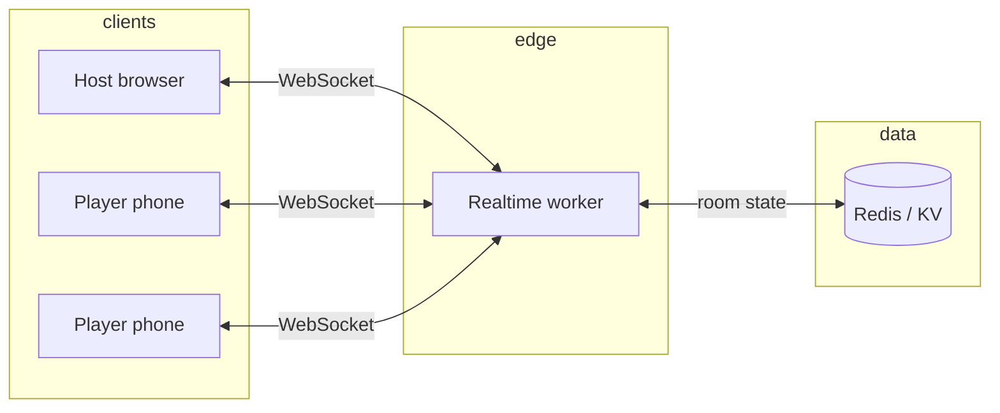

# Implementation plan (tentative)

**Last updated:** 2026-07-03 
**Status:** draft: expect rewrites after a playable vertical slice.

This document captures an initial technical and product plan for **Laro Tayo**: phone-based party games with Filipino cultural tailoring. Nothing here is locked.

---

## 1. Goals

### Must have (MVP)

- Host creates a **room** with a 4–6 character code; players join on mobile browsers.
- **One game** end-to-end: lobby → rounds → scoring → winner screen.
- **Taglish-ready** copy: English UI with Filipino prompt packs (and room setting for "Filipino-first" labels).
- Sessions survive **brief disconnects** (refresh rejoins same player slot).
- Works on **320px phones** and a **1280×720 host view** without horizontal scroll.

### Should have (post-MVP)

- Multiple games sharing one lobby infrastructure.
- Host can **kick / lock** room; optional player avatar colors.
- **Prompt packs** as data (JSON), not hard-coded strings.
- Basic **moderation**: family-friendly default pack, "mature barkada" pack gated behind host toggle.

### Won't have (yet)

- Native apps, accounts, payments, voice chat, custom avatars, AI-generated prompts.
- Real-money or gambling mechanics (keep it party, not e-bingo).

---

## 2. Product principles

1. **Phone is the controller**: host display is read-only except host controls (next, skip, settings).
2. **Filipino flavor in content, not gatekeeping**: diaspora friends can play; packs can mix Tagalog, English, and Taglish.
3. **Humor over competitiveness**: scoring exists but roasts and reveal animations matter more than esports balance.
4. **Offline-tolerant UX**: show clear "reconnecting…" states; never silently drop a submitted answer.
5. **No install**: PWA optional later; MVP is HTTPS website.

---

## 3. Architecture (proposed)



### Components

| Layer | Responsibility | Candidate tech |
| ----- | -------------- | -------------- |
| **Host UI** | QR + room code, round prompts, timers, scoreboard | Svelte 5 or React; static + SSR shell |
| **Player UI** | Join flow, input controls (text, tap, draw canvas) | Same codebase, responsive routes |
| **Realtime** | Room membership, broadcast events, authoritative round state | Cloudflare Durable Objects, PartyKit, or Socket.io on Fly |
| **Game engine** | Pure TS: phases, validation, scoring | `packages/game-core`: unit tested, no DOM |
| **Prompts** | Versioned JSON packs with locale tags | `packages/prompts` |
| **Deploy** | Preview per PR | Vercel (UI) + Cloudflare Workers (WS) *or* single CF Pages + DO |

**Recommendation for slice #1:** Cloudflare **Durable Objects** + **SvelteKit** on Cloudflare Pages: one vendor, good free tier, fits phone latency in PH.

Alternative if team prefers Vercel-only: **PartyKit** or **Liveblocks** for rooms + Astro/Svelte host/player apps (similar to Room TBA stack).

---

## 4. Room & session model

```ts
// Illustrative — not implemented yet
type RoomPhase = "lobby" | "starting" | "round" | "reveal" | "finished";

interface Room {
  code: string;
  hostSecret: string; // rotate if host refreshes
  phase: RoomPhase;
  gameId: string | null;
  players: Record<PlayerId, Player>;
  roundIndex: number;
  settings: RoomSettings;
}

interface RoomSettings {
  locale: "en" | "fil" | "taglish";
  packId: string;
  familyMode: boolean;
  maxPlayers: number; // default 8
}
```

**Events (server → clients):** `room.updated`, `round.started`, `round.tick`, `round.reveal`, `player.joined`, `player.left`, `error`.

**Commands (client → server):** `room.create`, `room.join`, `room.start`, `game.submit`, `host.advance`.

Idempotency: submissions keyed by `(roundIndex, playerId)`.

---

## 5. First game: **Charot o Totoo**

Pick one bluffing game first: minimal assets, maximum barkada energy.

### Flow

1. Host selects pack (e.g. *Memes & Showbiz*, *UPLB Edition*).
2. Each round shows a **setup** on host screen: `"Ang sabi ni ___: 'Petmalu ang luto mo!'"` 
3. Phones show the same setup; one player (or all) submits the **real** completion; others submit **charot** answers.
4. Host reveals submissions; everyone **votes** for what they think is totoo.
5. Points: fool others with your charot, guess totoo correctly, bonus if you wrote the real answer.

### Why first

- No drawing canvas or camera.
- Prompt data drives replayability.
- Exercises text input, voting, reveal UI, and scoring in one loop.

---

## 6. Prompt pack format (sketch)

```json
{
  "id": "memes-showbiz-v1",
  "locale": "taglish",
  "familyMode": true,
  "prompts": [
    {
      "id": "ms-001",
      "setup": "Finish the line from '{title}': \"{blank}\"",
      "metadata": { "source": "Four Sisters and a Wedding", "blank": "Push mo 'yan!" },
      "tags": ["movie", "meme"]
    }
  ]
}
```

Validation script in CI: no duplicates, profanity flag for family packs, max length for mobile keyboards.

---

## 7. Phased delivery

### Phase 0: Spike (1–2 sessions)

- [ ] Durable Object (or PartyKit) echo room: join, broadcast chat, leave.
- [ ] Single HTML host + player page with room code.
- [ ] Deploy preview URL.

**Exit criteria:** 4 phones + 1 laptop stable for 10 minutes on home Wi‑Fi.

### Phase 1: Charot o Totoo MVP

- [ ] `game-core` state machine + tests.
- [ ] 30 prompts in one pack (hand-authored).
- [ ] Host + player routes, lobby, 5-round game, winner screen.
- [ ] Reconnect via `playerToken` in `sessionStorage`.

**Exit criteria:** Complete game with 6 players without manual refresh.

### Phase 2: Polish & second game

- [ ] QR join, sound-off haptics-on feedback, better reveal animations (calm, not gimmicky).
- [ ] **Sino Yan?** categories (multiple choice buzzer: simpler than full charades).
- [ ] Host settings: locale, family mode, round count.

### Phase 3: Content & community

- [ ] Pack authoring doc + contributor guidelines for prompts.
- [ ] Issue templates for pack requests (e.g. "UAAP rivalries", "Ilocano food").
- [ ] Optional PWA "Add to Home Screen" for players.

---

## 8. Localization notes

- **UI chrome:** short English labels with Filipino subtitles optional (`Join` / `Sumali`).
- **Prompts:** store `locale` per pack; allow `taglish` strings inline.
- **Scoring copy:** prefer inclusive humor: roast the answer, not the person.
- **Names:** allow Unicode nicknames; filter slurs server-side with a static denylist (expand later).

Consult native speakers for **formal vs barkada** Filipino: default to informal neutral.

---

## 9. Non-functional requirements

| Concern | Target |
| ------- | ------ |
| Latency | < 150ms p95 room broadcast within PH |
| Concurrency | 50 active rooms (MVP); no hard player global limit yet |
| Privacy | No PII required; room codes expire after 2h idle |
| Accessibility | 44px tap targets, high contrast host view |
| Security | Rate-limit room creation; hostSecret for destructive actions |

---

## 10. Open questions

1. **Org/home:** `uplbtools/laro-tayo` vs personal fork: affects domain (`laro.uplbtools.me`?).
2. **Monorepo vs single app** for Phase 0 spike: lean single SvelteKit app until two games exist?
3. **Content moderation** for user-submitted prompts: defer until Phase 3?
4. **Monetization**: tip jar / "buy us milk tea" vs fully free forever?
5. **Drawing games**: canvas perf on older Android; worth Phase 2 or skip?

Track decisions in GitHub issues as they settle.

---

## 11. Next actions

1. Create Phase 0 spike issue with DoD from §7.
2. Pick realtime host (Cloudflare DO vs PartyKit) after a 2-hour prototype.
3. Draft first 10 **Charot o Totoo** prompts in a Google Doc → migrate to JSON.
4. Sketch host/player wireframes (Figma or ASCII in issue) at 320px and 720p.

---

*This plan will shrink or grow once the first room works. That's the point.*
